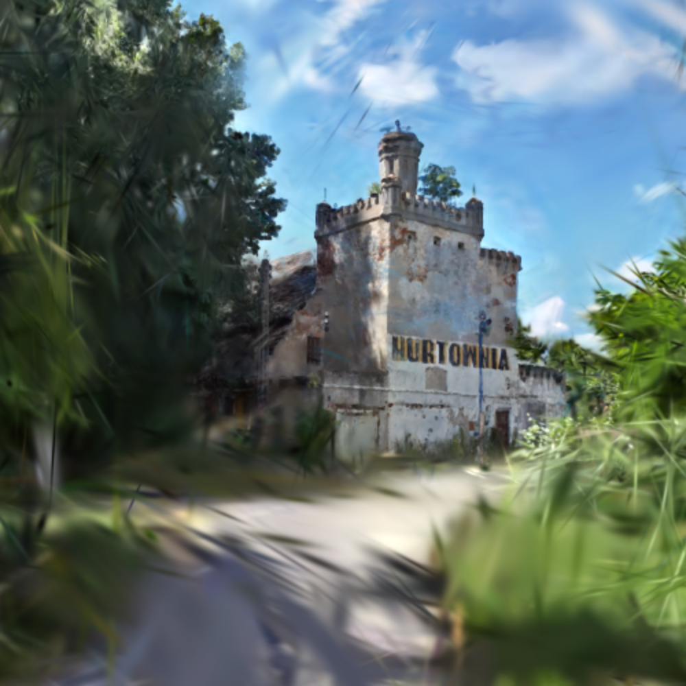

# WebGPU viewer for Gaussian Splatting nerfs



This repository contains the source for an interactive web viewer of NeRFs crated with the code available from [INRIA](https://github.com/graphdeco-inria/gaussian-splatting). The app with instructions is hosted at [jatentaki.github.io](https://jatentaki.github.io/portfolio/gaussian-splatting/).

## Building
This project has been created using **webpack-cli**. Before the first build, go to the code directory and execute `npm install` to install dependencies.

Afterwards, you can use
```
npm run build
```
to bundle the application or 
```
npm run serve
```
to have a live-updating server.

## Architecture
Unlike the original paper, this code doesn't use computer shaders to compute each pixel value independently but instead maps the problem to a standard rasterization technique, where each Gaussian is a flat rectangle facing the camera, with the actual content drawn via a fragment shader. I found this approach to yield substantially better framerates than compute shaders, although both are available in WebGPU.

This was my first substantial webdev project, therefore the code is far from idiomatic. I'm happy to receive PRs both to improve performance and to clean up the codebase.
